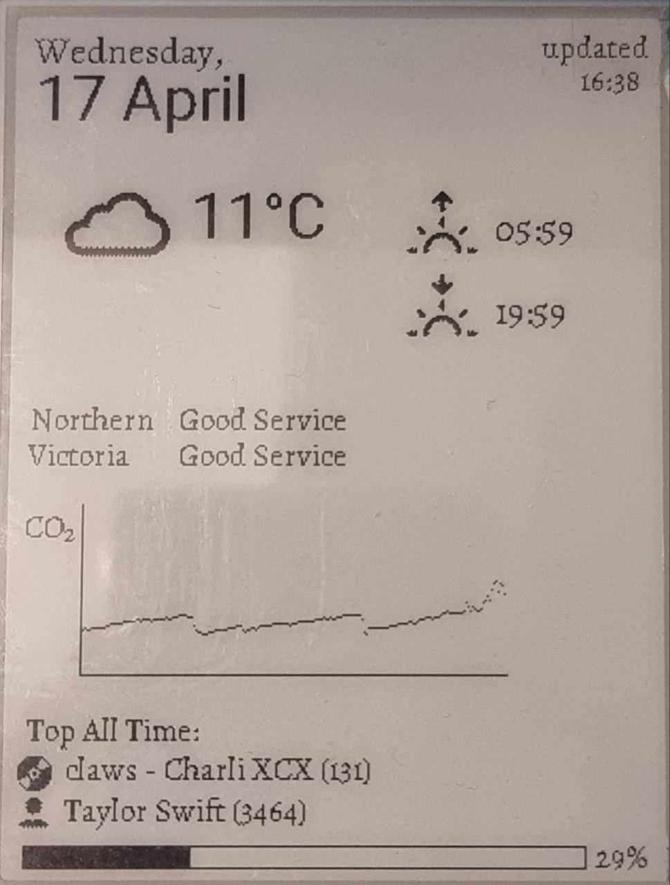

# Pi Display

A python based raspberry pi program that can run periodically to display various data points on an Waveshare e-ink display (I have created it for a 4.2 inch display but it is easily adaptable from others).

This was forked from the great work of [Rachel Bitting](https://github.com/rbitting/pi-display), thanks for setting up a great groundwork for me to work off of!

The display currently shows:
- Date
- Weather
- Sunrise/sunset
- London underground line status
- CO2 monitoring
- Last.fm data that cycles between 



## Prerequisites 

1. Install python 3.7+
1. Copy `.env.example` as `.env` and add your OpenWeatherMap and Last.fm api keys

## Pi Set Up

This set-up guide assumes you are running Raspbian on your Pi and have already set up internet access.

1. Complete the [Waveshare hardware/software set-up instructions for your relevant screen](https://www.waveshare.com/wiki/Main_Page#Display-e-Paper).

1. Set up a cron job to run the display refresh at regular intervals. Enter the command `crontab -e` to edit the crontab file. Then add the following line (this will run the script every 30 minutes):

    ```*/30 * * * * cd /home/pi/repos/pi-display/python && python3 main.py```

1. Set up a cron job to run the display refresh on Pi start-up. Enter the command `crontab -e` to edit the crontab file. Then add the following line:

    ```@reboot sleep 30 && cd /home/pi/repos/pi-display/python && python3 main.py &```

1. Run `npm install` and `npm run build` from in the `webapp` directory.

1. To launch the web app on Pi start-up, enter the command `crontab -e` to edit the crontab file. Then save the following line in the file (replace the paths with your Pi's paths):

    ```@reboot sleep 30 && cd /home/pi/repos/pi-display/webapp && /home/pi/.nvm/versions/node/v14.18.2/bin/node server.js >> /home/pi/logs/server.log 2>&1 &```

1. Set up a [static IP address](https://thepihut.com/blogs/raspberry-pi-tutorials/how-to-give-your-raspberry-pi-a-static-ip-address-update) for your Pi.

1. Install Apache web server on your pi: `sudo apt-get install -y apache2`

1. Update the Apache configuration file to proxy port 3000 requests. This will allow access to the webapp at the Pi's direct IP. Open the file:

    ```sudo nano /etc/apache2/sites-available/000-default.conf```
    
    then append the following within `<VirtualHost *:80>` under the `DocumentRoot /var/www/html` line:

    ```
    ProxyRequests off
    <Proxy *>
            Order deny,allow
            Allow from all
    </Proxy>
    <Location />
            ProxyPass http://localhost:3000/
            ProxyPassReverse https://localhost:3000/
    </Location>
    ```

1. Reboot the Pi for all updates to take effect.

## Notes

* All logs are stored under the `/logs` directory on your Pi

## Troubleshooting

* If display is printing incorrect times, you may need to update the timezone of your Pi: `sudo raspi-config` -> `Internationalisation Options` -> `Change Timezone` -> Follow screen directions to change country and time zone

* If you receive errors around the font files, update the font permissions: `chmod 744 assets/fonts`
